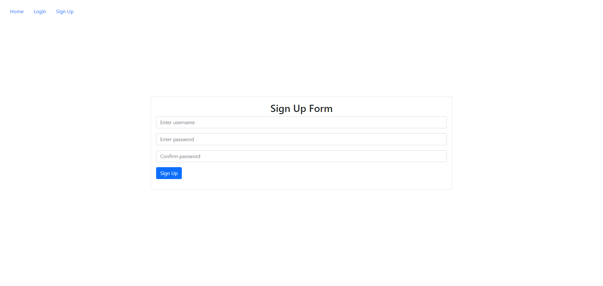
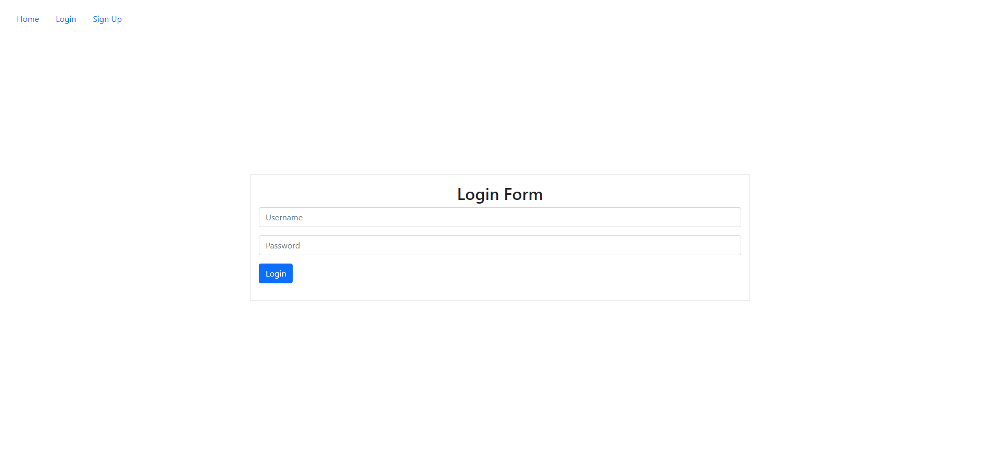
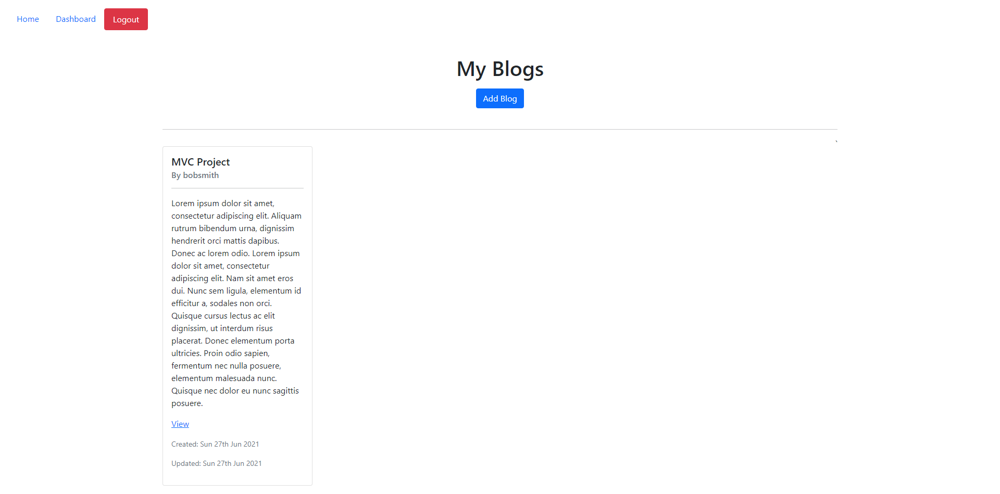
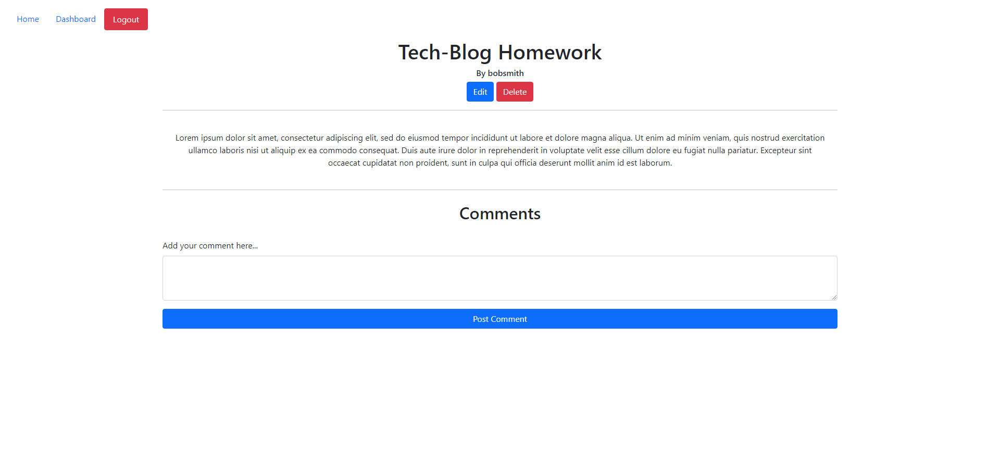
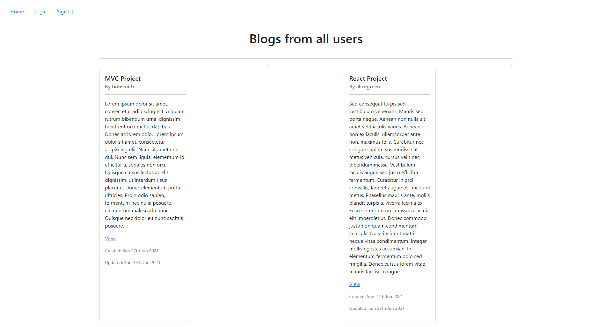
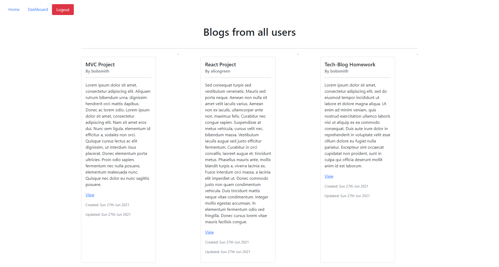
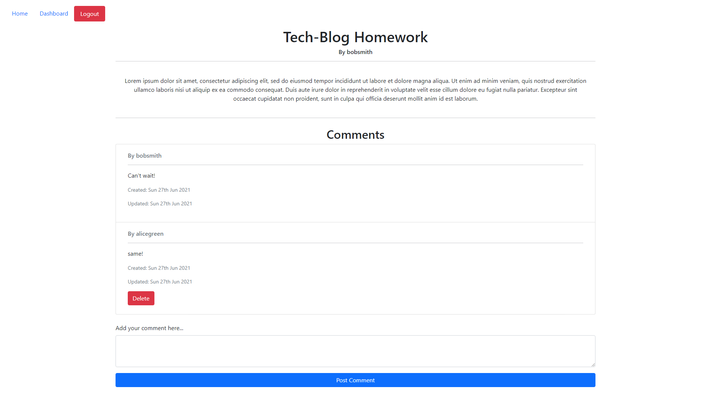

## Tech-blog

<h2> Table of Contents </h2>

- [Project Link](#project-link)
- [Description](#description)
- [User Story](#user-story)
- [What did we do](#what-did-we-do)
- [Screenshots](#screenshots)

## Project Link

Click [here](https://github.com/PDUBB3/tech-blog-mvc.git) to view project on Github repository.
Click [here](https://stark-shelf-93926.herokuapp.com) to view project on Heroku

## Description

In this project, I have built a CMS-style blog site similar to a Wordpress site, where developers can publish their blog posts and comment on other developers' posts as well. The app I have created follows the MVC paradigm in its architectural structure, using Handlebars.js as the templating language, Sequelize as the ORM, and the express-session npm package for authentication.

## User Story

As a developer who writes about tech, I want a CMS-style blog site so that I can publish articles, blog posts and my thoughts and opinions.

## What did we do?

I have created a tech-blog where I am able to do the following:

- [x] When I visit the site for the first time, then I am presented with the homepage, which includes existing blog posts if any have been posted; navigation links for the homepage and the dashboard; and the option to log in
- [x] I am taken to the homepage when I click on the homepage option
- [x] When I click on any other links in the navigation, I am prompted to either sign up or sign in
- [x] When I choose to sign up, then I am prompted to create a username and password
- [x] When I click on the sign-up button, then my user credentials are saved and I am logged into the site
- [x] When I revisit the site at a later time and choose to sign in, then I am prompted to enter my username and password
- [x] When I am signed in to the site then I see navigation links for the homepage, the dashboard, and the option to log out
- [x] When I click on the homepage option in the navigation, then I am taken to the homepage and presented with existing blog posts that include the post title and the date created
- [x] When I click on an existing blog post, then I am presented with the post title, contents, post creator’s username, and date created for that post and have the option to leave a comment
- [x] When I enter a comment and click on the submit button while signed in, then the comment is saved and the post is updated to display the comment, the comment creator’s username, and the date created
- [x] When I click on the dashboard option in the navigation, then I am taken to the dashboard and presented with any blog posts I have already created and the option to add a new blog post
- [x] When I click on the button to add a new blog post, then I am prompted to enter both a title and contents for my blog post
- [x] When I click on the button to create a new blog post, then the title and contents of my post are saved and I am taken back to an updated dashboard with my new blog post
- [x] When I click on one of my existing posts in the dashboard, then I am able to delete or update my post and taken back to an updated dashboard
- [x] When I click on the logout option in the navigation, then I am signed out of the site
- [x] When I am idle on the site for more than a set time, then I am able to view comments but I am prompted to log in again before I can add, update, or delete comments

## Getting started

- Create a new GitHub repository called tech-blog-mvc
- Clone github project onto your local machine
- Navigate into the project
- Open the project into VS code

```
git clone git@github.com:PDUBB3/tech-blog-mvc.git
cd readme-generator
code .
```

- Repo to include a `package.json` file by running `npm init -y` when you first set up the project.
- Add `start` script to `package.json`
- Create a `seed.sql` file to pre-populate our database
- Use `scheme.sql` filed in the `db` folder to create database with MySQL commands and use environmental variables to store sensitive data.

Installation

```
npm i
npm i sequelize express mysql2 handlebars express-handlebars dotenv bcrypt express-session connect-session-sequelize

```

Run

```
npm run start
npm run dev
npm run seed

```

## Screenshots

### Sign up form



### Login form



### My blogs



### Edit Blog



### All posts



### Seeing all blogs logeed in as another user



### Commenting as another user


